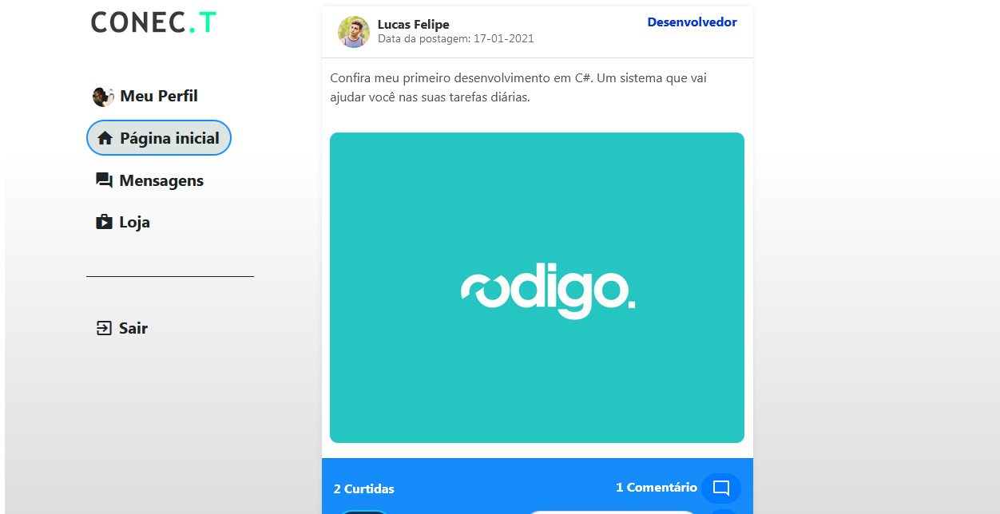

<link rel="stylesheet" href="https://cdn.jsdelivr.net/gh/devicons/devicon@v2.9.0/devicon.min.css">
<h2 align="center">
   
   <p>A Rede social que reúne desenvolvedores e clientes.</p>
</h2>

<p align="center"><a href="#techs">Tecnologias</a>&nbsp&nbsp<a href="#client">Conta Cliente</a>&nbsp&nbsp<a href="#dev">Conta Desenvolvedor</a>&nbsp&nbsp<!--<a href="#store"> CONEC.T Store &nbsp</a>--><a href="#guiauso">Guia de Uso</a></p>
</br>

> O projeto foi desenvolvido para realização do <b>Trabalho de Conclusão de Curso (TCC)</b> de Desenvolvimento de Sistemas

<p>O Projeto tem o objetivo de reunir programadores e clientes que querem públicar assuntos e ideias de seus interesses, através de uma rede social.</p>


<h1 id="techs">Tecnologias Utilizadas</h1>
<ul>
   <li>HTML</li>
   <li>CSS</li>
   <li>JavaScript</li>
   <li>PHP</li>
   <li>SQL</li>
   <li>Bootstrap</li>
   <li>Materialize (Icons)</li>
</ul>

<h1 id="client">Conta Cliente</h1>
<p>Na conta Cliente: Será possível apresentar demandas para os programadores desenvolver, compartilhar assuntos relacionados a tecnologia, conversar por chat e contratar um profissional para uma possível carreira promissora.</p>


<h1 id="dev">Conta Desenvolvedor</h1>
<p>Na conta Desenvolvedor: Será possível mostrar os projetos desenvolvidos, realizar demandas propostas por cliente, vender seus projetos na loja <b>CONEC.T STORE</b> e conversar pelo chat. </p>


<!--<h1 id="store">CONEC.T Store</h1>-->


<h1 id="guiauso">Guia de Uso</h1>
<ul>
   <li>Você vai precisar do Xampp em sua máquina.</li>
</ul>

<p>1. Clone o repositório na pasta <i>htdocs</i></p>

```
git clone https://github.com/myjefferson/CONEC.T-RedeSocial.git
```

<p>2. Inicie o Xampp e habilite o Apache e o MySQL</p>
<p>3. Acesse, no navegador, a aplicação web <i>phpMyAdmin</i></p>

```
localhost/phpmyadmin
```

<p>4. importe o Banco de Dados - DB (conec.t), localizado na pasta do projeto</p>

<hr/>